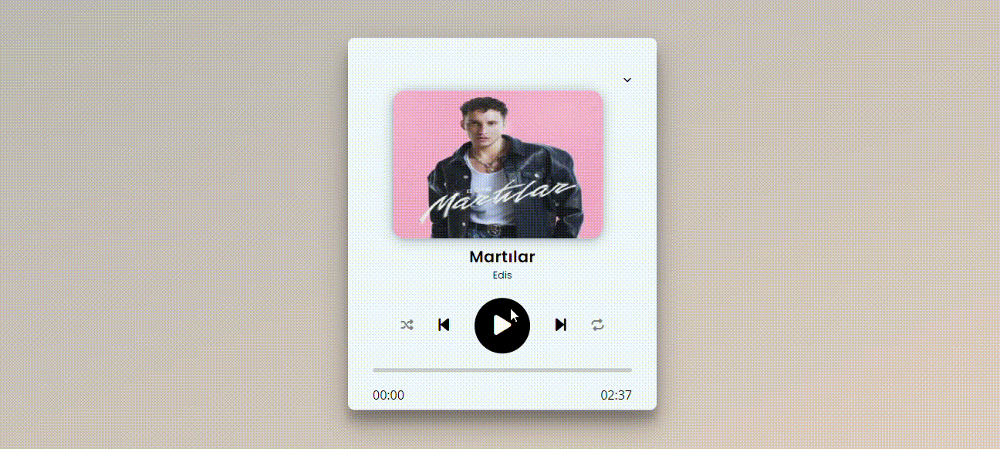

# Mp3PlayerJS

<h2>MP3 Player</h2>

This project is created with HTML, HTML5, CSS, CSS3 and JavaScript. It is an example of cd player system. User can change and switch the musics. Also user can see all of the musics from lists.

<h2>Technologies</h2>

-HTML -HTML5 -CSS -CSS3 -JavaScript -FontAwesome

<h2>Project Gif</h2>

You can see the project from this link: https://cdplayerjs.netlify.app

